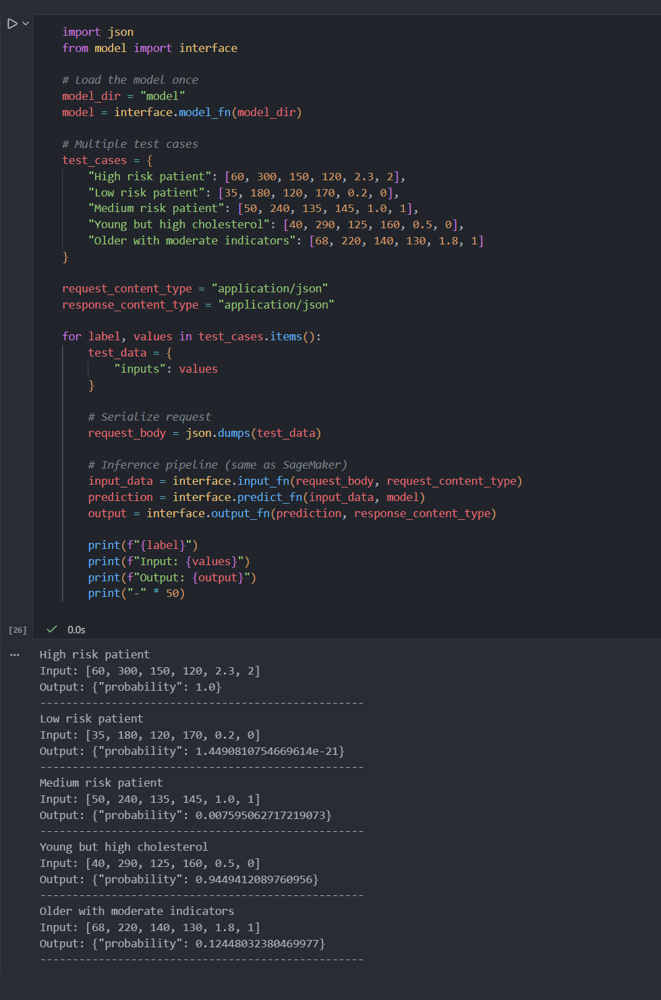

# Heart Disease Risk Prediction: Logistic Regression

**Escuela Colombiana de Ingeniería Julio Garavito**  
**Student:** Santiago Botero García

## Repository Structure and Contents

This repository contains the complete implementation and analysis required for the _Heart Disease Risk Prediction using Logistic Regression_ homework.

```
/
├── README.md
├── heart_disease_lr_analysis.ipynb
├── Heart_Disease_Prediction.csv
├── img/
|    └── local_test_results.png
└── model/
    ├── bias.npy
    ├── interface.py
    └── weights.npy
```

## Exercise Summary

This work implements a logistic regression model from scratch to predict the presence of heart disease using a real-world clinical dataset obtained from Kaggle (UCI Heart Disease dataset).

The notebook follows an end-to-end machine learning workflow, including:

- Exploratory Data Analysis (EDA)
- Feature selection and normalization
- Logistic regression implementation using gradient descent
- Model evaluation with classification metrics
- Visualization of decision boundaries
- L2 regularization and hyperparameter tuning
- Conceptual deployment using Amazon SageMaker

No machine learning libraries such as scikit-learn were used for model training; all core algorithms were implemented using NumPy, following class theory.

## Dataset Description

The dataset is governed under the
[Apache License, Version 2.0](https://www.apache.org/licenses/LICENSE-2.0)

and contains 270 patient records with 13 clinical features and 1 binary target variable.

Target variable:

- 1 &rarr; Presence of heart disease
- 0 &rarr; Absence of heart disease

Approximately 55% of the samples indicate heart disease presence, making the dataset moderately balanced.

Dataset source:

https://www.kaggle.com/datasets/neurocipher/heartdisease

### Column Descriptions

| Column Name             | Description                                                                                              |
| ----------------------- | -------------------------------------------------------------------------------------------------------- |
| Age                     | Age of the patient (in years)                                                                            |
| Sex                     | Gender of the patient (1 = Male, 0 = Female)                                                             |
| Chest pain type         | Type of chest pain: 1 = Typical angina 2 = Atypical angina 3 = Non-anginal pain 4 = Asymptomatic         |
| BP                      | Resting blood pressure (mm Hg)                                                                           |
| Cholesterol             | Serum cholesterol level (mg/dL)                                                                          |
| FBS over 120            | Fasting blood sugar > 120 mg/dL (1 = True, 0 = False)                                                    |
| EKG results             | Resting electrocardiogram results: 0 = Normal 1 = ST-T wave abnormality 2 = Left ventricular hypertrophy |
| Max HR                  | Maximum heart rate achieved                                                                              |
| Exercise angina         | Exercise-induced angina (1 = Yes, 0 = No)                                                                |
| ST depression           | ST depression induced by exercise relative to rest                                                       |
| Slope of ST             | Slope of the peak exercise ST segment                                                                    |
| Number of vessels fluro | Number of major vessels (0–3) colored by fluoroscopy                                                     |
| Thallium                | Thallium stress test result (categorical medical indicator)                                              |
| Heart Disease           | Target variable: Presence = Heart disease detected Absence = No heart disease                            |

## Methodology Overview

### 1. Data Preparation & EDA

- Dataset loaded using `kagglehub`
- Target variable binarized
- Column names standardized
- Class distribution analyzed
- Numerical features normalized
- Stratified **70/30 train-test split**

### 2. Logistic Regression Implementation

- Sigmoid activation function
- Binary cross-entropy loss
- Gradient descent optimization
- Cost convergence tracked over iterations

### 3. Model Evaluation

Performance evaluated using:

- Accuracy
- Precision
- Recall
- F1-score

Metrics were computed on **both training and testing sets**.

## Decision Boundary Visualization

To analyze feature separability, logistic regression models were trained on **multiple 2D feature pairs**, including:

- Age vs Cholesterol
- Blood Pressure vs Max Heart Rate
- ST Depression vs Number of Vessels

Decision boundaries were plotted alongside true class labels, revealing varying degrees of linear separability depending on the selected features.

## Regularization Analysis

L2 regularization was applied to mitigate overfitting.
The regularization parameter $\lambda$ was tuned over the following values:

$$
\lambda \in {0, 0.001, 0.01, 0.1, 1}
$$

Comparisons were made using:

- Classification metrics
- Weight vector magnitude $||w||$
- Cost convergence behavior

An optimal $\lambda$ value improved generalization while reducing model complexity.

## SageMaker Deployment Instructions

To simulate a production environment, the trained model was prepared for deployment using **Amazon SageMaker**.

### Package Model Artifacts

Compress the trained model folder into a `.tar.gz` archive:

```bash
tar -czvf model.tar.gz model
```

### Upload to S3

- Go to your **S3 bucket** (default name: `heart-disease-lr`)
- Click **Add Files** and upload `model.tar.gz`
- Leave all default settings and complete the upload

### Prepare IAM Role

- Navigate to **IAM &rarr; Roles**
- Use the pre-created role (e.g., `LabRole`) for SageMaker
- Copy the **Role ARN** for later use

### Create a SageMaker Model

- Open your SageMaker instance
- Go to **Models &rarr; My Models &rarr; Create**
- Set the container configuration:
  - **Framework:** PyTorch
  - **Version:** 2.1
  - **Hardware Type:** CPU

- Specify the **S3 URI** for the uploaded `model.tar.gz`
- Paste the **IAM Role ARN** for security

### Create an Endpoint

- Navigate to **Deployments &rarr; Endpoints &rarr; Create Endpoint**
- Add the model created above and leave default deployment settings
- Click **Deploy**

> Important: The model could not actually be deployed because the current IAM policies restrict the SageMaker endpoint from assuming the necessary roles. While you can prepare the model and upload it to S3, endpoint creation will fail if the IAM permissions are insufficient. You can still test the model functionality using a SageMaker notebook or local inference scripts.

### Local Test and Results

Since the model could not be deployed to SageMaker, a local test was performed instead. Below are the results from that test, which demonstrate how the model performs in a local environment.



Once deployed (or tested locally), you can test predictions with tools like Postman or directly from Python.
